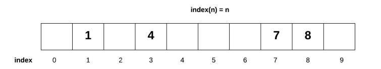

# Using Sets is Python

Welcome to the Sets tutorial!

A **set** is type of data structure commonly used in programming.

Unlike other data structures, the order of the data in a set is not important. It is known as a **sparse list** because it is an array that is only partially filled.



### Sets are used to:
* Summarizing data.
* Finding duplicates.
* Find specific values in a list.
* Save previously calculated results for quick access at a later time.
* Perform mathematical operations.

## Hashing
**Hashing** is used to map an item to a specific index using the **hashing function**.
The hashing function converts the value of an item to a numerical index value. Python has a built-in hash function. The values returned by the hash function will be different each time that you run it, but will stay the same as you are working with those values. They won't change until the function is run again.

There are limitations to hashing:
* Python listed cannot be hashed

## Conflicts
There are two common ways to deal with conflict while using sparse lists:
* Open Addressing
* Chaining

Whether we are trying to insert a value into a set, or check to see if a specific value is already in a set, we can use **Open Addressing**. Open addressing checks to see if there is something already occupying a specific space (or if it's the value we're looking for), if there is (or not there), it moves on to the next space until it finds the next open space (or the value we're looking for). 

**Chaining** is allows for multiple values to be stored in the same space.

## Key Characteristics
* Quick way to add, remove, and find specific and unique values.
* Duplicates cannot be added.
* No error will be raised when trying to add a duplicate value to a set.
* Sets will not keep values in order.
* Perform mathematical set operations.

## How to use sets in Python3
Create a new empty set:
* empty_set = set()

Create a set with values:
* new_set = {1, 2, 3}

Find the common values between two sets:
* new_set = intersection(set1, set2)
* new_set = set1 & set2

Combine values of two sets:
* new_set = union(set1, set2)
* new_set = set1 | set2

## Example Problem
Perform an intersection between **set1** and **set2**

```python
def intersection(s1, s2):
    int_set = set()
    for i in s1:
        for j in s2:
            if i == j:
                int_set.add(j)
    return int_set

set1 = {1, 2, 3, 4, 5, 6, 7}
set2 = {6, 7, 8, 9, 10, 11, 12}
print(intersection(set1, set2))
```

## Try It Yourself!
Perform a union between **set1** and **set2**

You can find the solution here: https://github.com/Manders0689/Final-Project/blob/main/union_solution.py