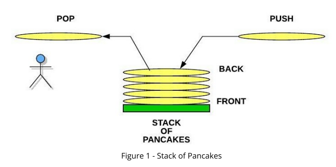

# Using Stacks is Python

Welcome to the Stacks tutorial!

A **stack** is a data structure that is most often refered to as a LIFO, which means "Last In, First Out". The order in which items are added and removed is what makes this type of data structure a stack.

Think of a stack of pancakes. As you make them, the first ones get placed on the plate first, but the ones placed last are the ones that get removed from the stack first, as they are the ones on the top. 


## Basic Terminology
* Push - to place an item onto the stack.
* Pop - to remove the last item added from the stack.
* Back - where a new item is placed when added to the stack.
* Front - the very first placement in a stack.

## Function Stack
We use stacks when calling functions all the time! This is done by calling a function in our program, then calling another function before the original function ends.

Example 1:
Function A is called, but before it ends, Function B is called. Function B will be fully resolved first, then it goes back to Function A to finish running. 

Example 2:

In: A, B, C, D, E, F

Out: F, E, D, C, B, A

Last function called, first function finished.

## Using Stacks in Python
Push an item to the back of the stack:
* my_stack.append(value)

Delete the last item from the stack:
* my_stack.pop()

Determine the size (or length) of a stack:
* length = len(my_stack)

Determine if a stack is empty:
* if len(my_stack) == 0:

## Example Problems
Write a function that iterates through a string and adds each character to a stack.

```Python
def add(text):
    stack = []
    for letter in text:
        stack.append(letter)
```

Now write a function that iterates through a string and deletes each character from a stack.

```Python
def delete(text):
    stack = [abcdefg]
    for letter in text:
        stack.pop(letter)
```

## Try it Yourself!
Use what you have learned about adding, popping, and iterating to solve this problem. 
1. Create a function that iterates through a string of text and adds each character to a new stack. 
2. Define a new variable as an empty string.
3. Create a while loop to run while the length of the stack is greater than 0.
4. In the while loop, pop each character off the back of the stack and add it to the empty string.
5. Return the new string.
Add these print statments at the end of your code to test:
```Python
print(func("kayak")) # result = "kayak"
print(func("reward")) # result = "drawer"
print(func("mr own ate my metal worm")) # result = "mrow latem ym eta nwo rm"
```

You can find the solution here: https://github.com/Manders0689/Final-Project/blob/main/stacks_solution.py 